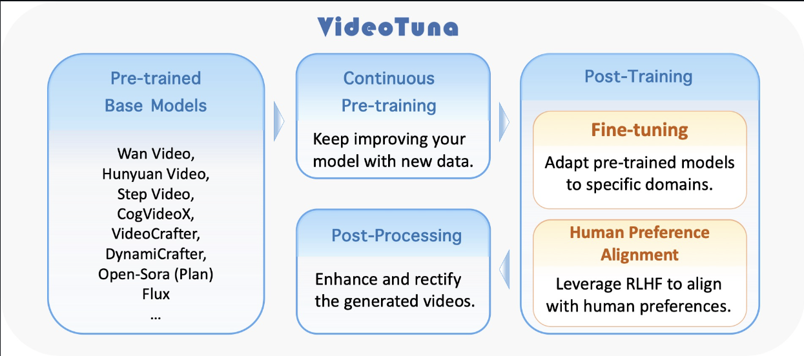

Welcome to VideoTuna v0.2's documentation!
==========================================

`VideoTuna <https://github.com/VideoVerses/VideoTuna/>`_ is a useful codebase for text-to-video applications.

 VideoTuna is the first repo that integrates multiple AI video generation models including text-to-video (T2V), image-to-video (I2V), text-to-image (T2I), and video-to-video (V2V) generation for model inference and finetuning (to the best of our knowledge).

VideoTuna is the first repo that provides comprehensive pipelines in video generation, from fine-tuning to pre-training, continuous training, and post-training (alignment) (to the best of our knowledge).

Check out the :doc:`getting_started/installation` section for a detailed tutorial.

VideoTuna v0.2 hosts its documentation on Read the Docs.

.. note::

   This tutorial project is under active development.

Documentation
------------------

.. toctree::
  :maxdepth: 1
  :caption: Getting Started

  getting_started/installation
  getting_started/data_preparation
  getting_started/api

.. toctree::
  :maxdepth: 2
  :caption: Advanced

  advanced/acceleration
